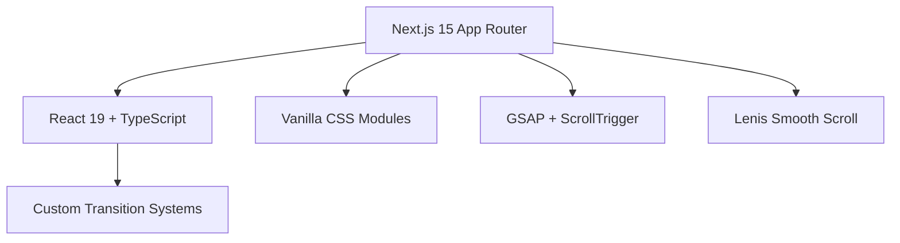

# ✦ ZENITH SOUMYA | IoT & AI Systems Developer Portfolio ✦

Welcome to the digital foundry of **Zenith Soumya** (the Lord Artificer), a Computer Science & Engineering student at ITER College (Siksha 'O' Anusandhan) specializing in IoT architectures, offline-first mobile systems, optimized Java/DSA engines, and agentic AI full-stack applications.

This portfolio is not just a resume; it is a high-performance web experience engineered for sub-millisecond visual responses, fluid motion telemetry, and interactive sandbox environments.

---

## 🛠️ Tech Stack & Systems Architecture



* **Framework Core**: **Next.js (App Router)** + React 19 + TypeScript.
* **Styling & Design Tokens**: Scoped **Vanilla CSS Modules** for local modularity + custom global tokens declared in `styles/variables.css` and `styles/globals.css`.
* **Motion & Kinetic Scroll**:
  * **GSAP (GreenSock) & ScrollTrigger**: Driving all premium micro-animations, text line reveals, and typewriter telemetry effects.
  * **Lenis Scroll**: Configured globally for smooth, physics-based kinetic mouse-wheel scrolling.
  * **Framer Motion**: Powering isolated layout animations and reactive spring overlays.

---

## ✨ Immersive Interactive Features

### 1. 🎭 The International Welcome Screen
Before entering the main viewport, a sequential greeting cascade rotates through **14 international languages** at custom intervals, concluding with a high-precision analogue film horizontal scanline glitch mapping the initials `Z` & `S` right before flight.

### 2. 🧠 Agentic AI Visualizer
A fully interactive SVG canvas demonstrating real-time agentic query routing:
* **Interactive Node Inspector**: Detail payload specifications, latency counts, and execution tokens by hovering or selecting active nodes.
* **Model Router Override Locks**: Manually lock system weights and route payloads to specific configurations:
  * *Gemini 3.5 Flash*
  * *Gemini 2.5 Flash*
  * *Gemini 3.1 Lite*
* **Telemetry Packets**: High-performance animated SVG packets traverse the canvas, visualizing data flow telemetry.

### 3. 📂 Multi-Turn Work Index & Case Studies
An index of **7 selected developer projects** spanning embedded, full-stack, and developer utility domains:
1. **FURINA**: Theatrical AI Fontaine Chat engine utilizing Groq LPU inference.
2. **FLAVR**: React 19 pantry chef web app with Web Audio sizzle synthesis.
3. **FLOWSTATE**: Gamified mobile habit RPG built with Flutter + Hive NoSQL.
4. **LUMINA**: Empathy-adaptive cross-platform companion mobile app with a FastAPI + Supabase backend ledger.
5. **NUTRILENS**: Next.js 15 PWA vision nutrition assistant.
6. **CARTSNAP**: Flutter Point of Sale with direct hardware Bluetooth thermal printer binding.
7. **FREELLMAPI**: Developer proxy router aggregating free LLM tiers with failovers and AES-256 encrypted storage.

Each project contains custom **Telemetry Lists** (gallery/list modes), dynamic accent grids, and detailed architectural ledgers.

---

## 🚀 Local Installation & Setup

### Prerequisites
* **Node.js** (v20+ recommended)
* **npm** or **yarn**

### Installation Steps
1. **Clone the Repository**:
   ```bash
   git clone https://github.com/byteWizard-zero/PORTFOLIO.git
   cd PORTFOLIO
   ```

2. **Install Dependencies**:
   ```bash
   npm install
   ```

3. **Launch local dev server**:
   ```bash
   npm run dev
   ```
   Open `http://localhost:3000` to run the development environment.

4. **Compile Production Bundle**:
   ```bash
   npm run build
   npm run start
   ```

---

## 👨‍💻 Creator Profile

* **Architect**: **Zenith Soumya** (self-described system designer)
* **Focus Area**: IoT Systems, Advanced Algorithms & DSA (Java), Mobile Architectures, and Multi-Modal Generative AI pipelines.
* **Academic Home**: ITER College · Bhubaneswar, Odisha, India.
